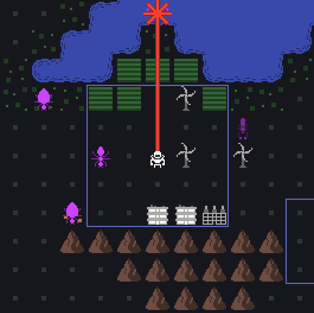
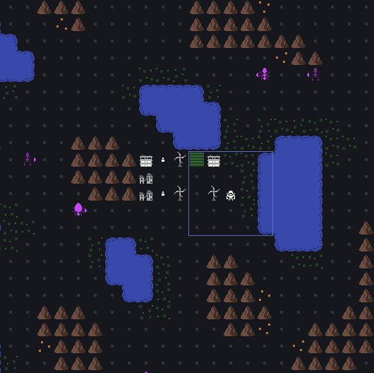

Lots of progress towards Alpha 3 this month. I implemented all of the new enemies, bringing the total from 1 to 5:

- Soldier: basic enemy that is already in the game
- Beetle: armored enemy that blocks 1 laser, then turns into soldier
- Flyer: winged enemy that can fly over water
- Burrower: digging enemy that evades your lasers until it's ready to attack
- Volatile: explosive enemy that damages everything adjacent when it dies

Next, I rewrote the AI. It now chooses it's targets more intelligently, paths to them better, and coordinates with other enemies. These improvements will also enable some interesting new defensive buildings for the player. Additionally, there's now an indication of the AI's next move. Players could see this before by waiting a turn, remembering where the AI went, then undoing that turn. That's annoying, but could be optimal in some situations, so I decided to make that an actual feature:

Next month, I'm moving on to new buildings for the player. Roads, warehouses, batteries, decoys, shield generators... and reworks of farms and generators. Lots of new toys for the player!