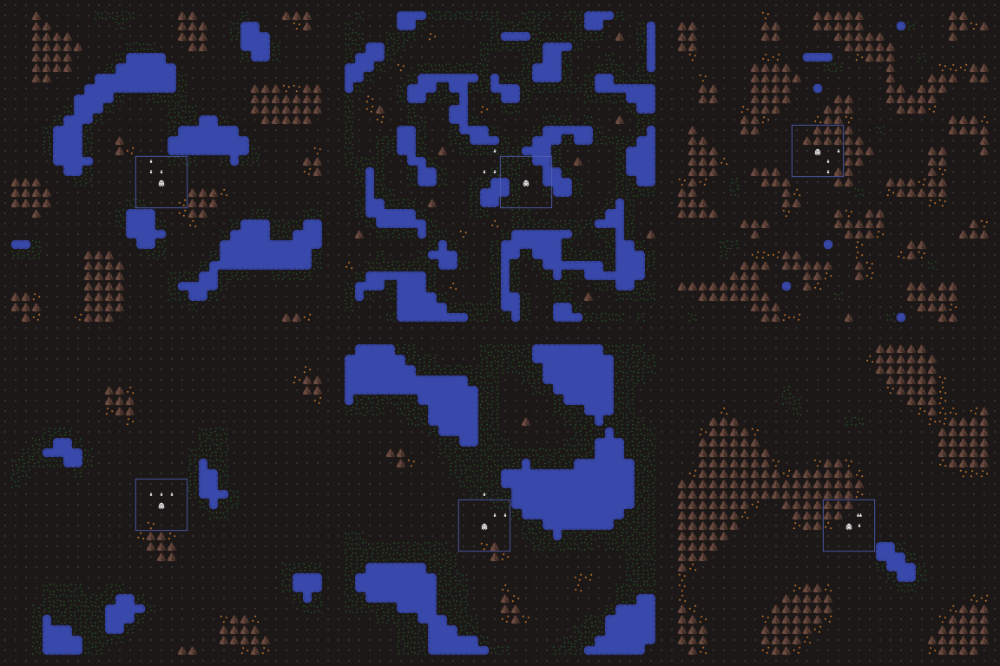
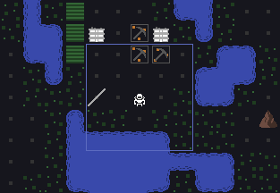

This month mostly got derailed by a home search (spoiler alert: next month will be derailed by moving), but I still got a decent amount done:

- **Map Variety**: there are now 6 types of maps: standard, marsh, badlands, plains, lakes, and mesa! For now, one of those is selected randomly, but for release there will be a menu to choose your map type. Marsh and badlands in particular should make for some challenging base building.
- **Longer-lasting Reflectors**: New players are often confused by reflector/projector range. To help make that clearer, instead of immediately disappearing, reflectors that are out of range will stay for one turn and flash.
- **Stronger Walls**: Slight buff to walls, which can now take 3 hits instead of 2.
- **Big Updates Under the Covers**: Updated basically all of the build tools and 3rd party libraries, for a smoother development workflow. The optimized builds are broken currently, so I'll a little more to do here before release.

Here's a screenshot of the maps:

And a gif of the reflectors:

I'm moving next month, so I don't expect to get a whole lot done. Next up are the absorber and shield generator buildings, which will finish off the new content for Alpha 3. Hopefully I can get those done. Then it's a lot of balance, tweaks, and UI.
