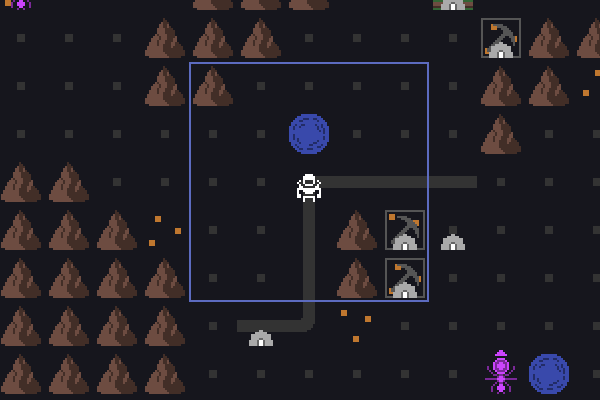

Lots of progress the past 2 months! All the new content for Alpha 3 is done, and now I'm working on the long tail of balance and polish. Here's a quick summary of whats new:

- **Absorbers**: A new building that can "store" a laser shot for later
- **Shield Generators**: Another new building that uses a lot of power to protect your buildings, but it also blocks your own lasers!
- **Improved Laser Graphics**: Lasers glow and pulse while aiming, and flash when you shoot
- **Less Random Enemy Waves**: This especially effects the early days, which could be swing wildly with the RNG
- **Visible Farm Growth**: This helps you see your progress, but also comes with a small gameplay change: when enemies attack farms, they destroy the growth but leave the field itself intact
- **Move Fast on Roads**: The player character now benefits from roads! Previously only your colonists did
- **Buildable Tents**: You now have control over tent placement. No more will your plans be ruined when a colonist decides to pitch a tent in a critical location!
- And lots of other bug fixes and usability improvements!

Take a look at the new graphics (and the fast roads):

The release of Alpha 3 is in sight, but I still have lots of balance and usability improvements to do. Plan is to release around the New Year!
