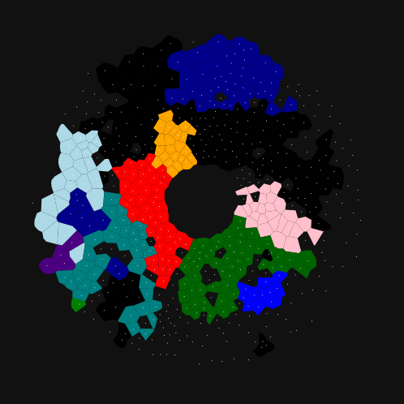
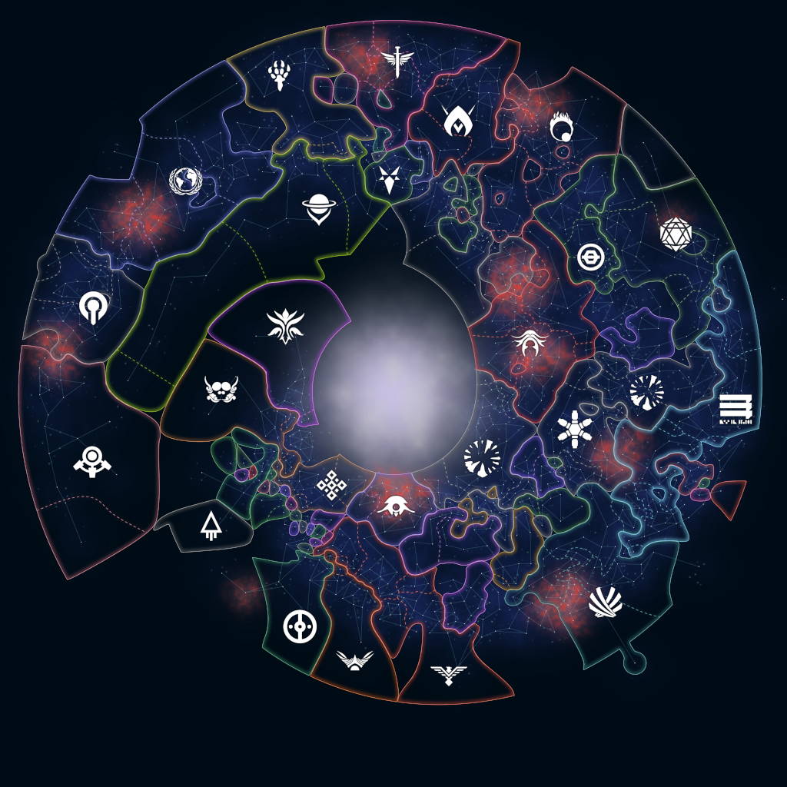
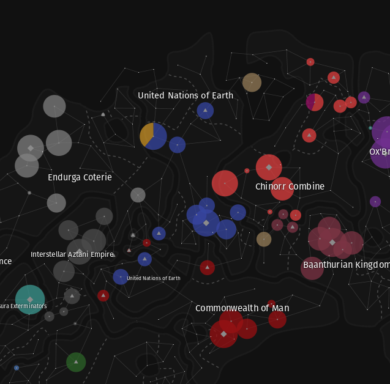

Last August, I started working on a program to draw maps of Stellaris saves. It started as just an experiment, a way to play with some technologies. Maybe a few weeks or a couple months. Well, here I am one year and thousands of lines of code later, still working on it, and it's been my main (but not only) non-work project for the duration.

## What is StellarMaps?

StellarMaps is a program makes stylized and customizable maps from the [sci-fi strategy game Stellaris](https://www.paradoxinteractive.com/games/stellaris/about).

There are some existing programs with this capability, such as [RandomComputerUser's Stellaris Map Generator](https://randomcomputeruser.github.io/stellaris/stellaris-map-generator/index.html), [myaut's Stellaris Galaxy Map](https://stellaris-galaxy-map.website.yandexcloud.net/), and [blubblubblobb's Stellaris Dashboard](https://steamcommunity.com/sharedfiles/filedetails/?id=1466534202). However, none of these are as customizable as I would like, and are missing various feature's such as displaying country emblems. I decided to make yet another, partly to address those issues and partly because making maps is simply fun.

## The Progress So Far

StellarMaps has come far, from the first screenshot I posted to today:

  
  

This year, I released 11 feature updates:

- 0.1: borders, stars, and hyperlanes
- 0.2: country names and emblems
- 0.3: sector borders, capital/populated solar system icons
- 0.4: unions mode, terra incognita, circular borders style
- 0.5: PNG export
- 0.6: mod support
- 0.7: savings styles, lots of customization options, "metro" style
- 0.8: wormhole/gateway icons and paths
- 0.9: solar system tooltips, big under-the-hood rendering changes
- 0.10: starscape graphics, rewritten save parser
- 0.11: system labels, localization support

## The Future

I'm currently working on 0.12, the main feature of which is map modes and legends. "Map modes" are options for displaying data on the map, besides borders and locations. For example, coloring countries based on their relation with the player country. Stellaris has a set of map modes in-game. They are moddable, but quite limited. Critically, they can only change the colors of country borders, and cannot display data on anything more granular, like solar systems. With StellarMaps, I can explore map modes that are impossible in-game, such as this WIP population map mode:

After 0.12, I plan to add the ability to generate timelapses of the galaxy. Maps are cool, timelapses are cool, and together they're amazing. Even before the 0.1 release, I posted about how someday I'd love to generate timelapses, so that's definitely been a long-term goal of the project that's gotten pushed back multiple times. I'm committing to 0.13. For real this time.

Beyond that, things get hazier. This could be a never-ending project. There will always be more data that could be displayed, or new ways of displaying that data, or just options for styles. I will definitely implement some of that, but there's also larger features I could explore. Most intriguing to me at the moment, is the possibility of expanding StellarMaps beyond Stellaris. Several people have expressed interest in using StellarMaps to create sci-fi maps for their fiction and world-building projects. That would be a large undertaking, but could bring StellarMaps to a whole new audience.

## Personal Reflection

Spending a year (or multiple years?) working on a tool (or toy?) for someone else's game is not something that was ever a goal of mine. From a certain perspective, this project hurts my goals: I aspire to make games (as suggested by username), and working fulltime as a software developer, my free time and mental capacity is limited. I can only substantially make progress on one non-work project at a time. Working on StellarMaps has a large opportunity cost.

However, I need to ask myself why I make games? In rough priority:
- personal creative fulfillment
- make something others enjoy
- hone my software development skills
- maybe some additional income?

StellarMaps actually fulfills all of these:
- it is creatively engaging work
- others are using it, and bonus, they are using it as a tool in their own creative endeavors
- it is a technically challenging project
- no money yet, but I've had multiple people ask about a Patreon

So StellarMaps will remain my main project at least through 0.13 (timelapses), and perhaps beyond. We'll see what the next year brings.