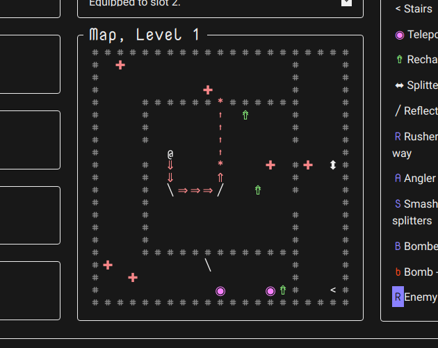

This year I completed my first 7DRL, Reflector RL (source). The idea was a game where your only weapon is a laser that can be fired in the four cardinal directions, but your enemies are able to move and attack in all eight directions. To make up for your lack of maneuverability, you need to place reflectors and splitters to manipulate your lasers.

### The Good

I wanted to keep the game focused on manipulating the laser beams. Overall, I think it works as a core mechanic, and creates some interesting and unique scenarios. Early in the week, you could get away without actually using the reflectors and splitters much. More enemies and longer recharge times on the weapons created more pressure. If you're only killing one enemy per shot, you won't last long.

I decided to stick with technologies I know: Typescript, React, Redux, and rot.js. My goal was to make a game, not learn a new programming language. Typescript gave me some troubles at first, but once set up, the safety and editor support it provides saved me from lots of bugs. I plan to stick with this set up for future roguelike projects.

This is my first complete game, playable from start to finish, and I think it's fun. What more could I ask? My previous projects got bogged down in the possibilities and technology, but the 7DRL format forced me to keep my scope limited. I now have a solid base to iterate on, both mechanically for this game, but also technologically for future projects.

### The Bad

I'm not sure how balanced it is. In my initial plan, I reserved the final three days of the challenge for balance. I ended up with closer to a day and a half. I have beaten the game once, but I haven't played it enough to know how much of that was luck. Time will tell.

The player doesn't move around quite as much as I want. On each level, I end up spending most of the time in whatever corner of the map I spawned in. I introduced both the teleporter gun and on-map teleporters to help with this issue. It's definitely better than it was before, but I'm still not quite satisfied.

Around 10pm the final night, I realized I should test the game with other screen sizes. That led to a mad dash to make the UI fit on screens that aren't giant. It now fits on most screens, but still isn't very responsive. Definitely going to look at that earlier next time.

### The Future

I am going to keep working on Reflector. I have ideas for more content and mechanics that I didn't have time to implement. However, before I get to those, I'm going to clean up the code a bit, add graphical tiles, and making the game mobile friendly (I want more roguelikes on my phone). Then it's on to balance and more content.
