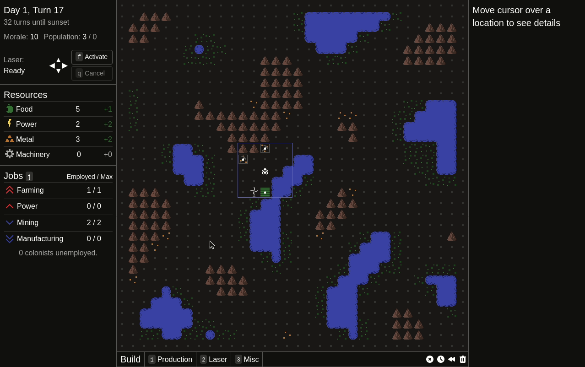

I spent the first part of this month planning, building, and testing the new interactive tutorial. That has been released along with all the other changes from the past 3 months, so rather than talking about it at length, I'll just let you go play it over at [itch.io](https://mscottmoore.itch.io/reflector).

After the release, I took a bit of a brake for relaxation and so I wouldn't be in the middle of anything if any major bugs came up. Looks like the current release is pretty stable, so I've started working on Alpha 3, which is focused on combat. To start off though, I'm cleaning up some older parts of the code.

First up was the building code. I couldn't resist making a UI improvement that the new and improved code made possible: the inspector now tells you specifically why you cannot build in invalid locations:

This next month will probably be more code cleanup and small tweaks like the above, and I likely won't start working on the heart of Alpha 3 until March.

If you want to read more about long term plans, as well as review of the year, [I wrote a post](https://www.reddit.com/r/roguelikedev/comments/l2q1je/2021_in_roguelikedev_reflector_laser_defense/) for the 2021 in RoguelikeDev event over on r/roguelikedev.