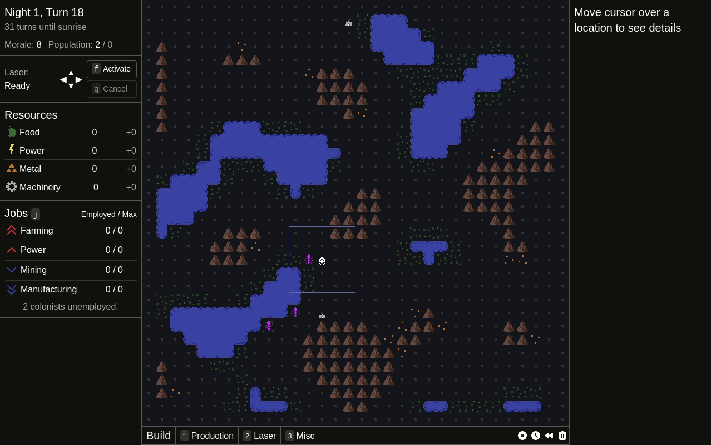

Behind the scenes refactoring continues, but I also made some improvements to the graphics. Here's a gif demonstrating many of the improvements:

- The player, enemies, and colonists now slide smoothly between tiles instead of teleporting from one spot to the next.
- Enemies "bump" towards the thing they attack
- There's a destruction animation. Currently it's an explosion, but that will likely change to something more like a dust cloud, as explodable things is a planned mechanic for Alpha 3.

These last 3 are not in the gif:

- Audio! I hear most games include this. Reflector now has music and some placeholder sfx.
- The building preview in the build menu now fully renders the buildings, instead of a single-color silhouette.
- Some buildings can now be built on top of others, without first needing to deconstruct. For example, advanced splitter on top of a splitter.

March is likely not to be especially productive, as this first week will be spent preparing for the 7DRL game jam, the second week actually doing the jam, and then I'll possibly follow-up with a bug fix release for the 7DRL. April should see a start on new mechanics and content for Alpha 3.
