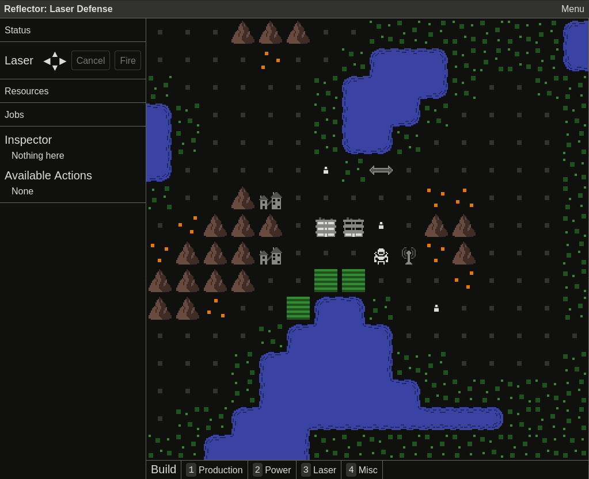

May was focused on the big UI redesign for Alpha 2. The main goals of redesign are:

1. Everything should be fully usable with only the mouse or only the keybaord
2. All important information should be visible at a glance without needing to "inspect" anything or take any other actions
3. Controls and mechanics should be easily discoverable

I've made good progress, especially on the first two points. Here's a gif demonstrating the changes and below that, a detailed list:

- Production buildings emit smoke when they are being worked, indicating how many colonists are working there
- Colonists light up the windows when home, indicating how many are currently in the residence
- The tile that the cursor is hovered over in the map is highlighted
- Right click the map to access a menu of actions available for that tile
- In the side bar, display the contents of the highlighted tile
- In the side bar, display the actions available for the highlighted tile, along with their keyboard shortcuts
- Keyboard controls for changing the highlighted tile (shift + direction moves the highlighted tile)
- Keyboard controls for moving the character (arrows, wasd, or vim keys)
- Keyboard controls for aiming and firing the laser (ctrl + direction to aim, press again to fire)
- Mouse controls in sidebar for aiming and firing the laser
- Click the map to cycle between placing a reflector, rotating it, or removing it. Also works by pressing space or enter
- Lots of miscellaneous changes and refactoring to support all of the above

The first part of June will be dedicated to the remaining major pieces of the new UI: build controls (in progress), the status panel, the resources panel, and the jobs panel. Beyond that, I have a long list of smaller UI enhancements, but at that point I'll likely start alternating between playtesting/balancing and working on the UI. For alpha 1, testing by both myself and others revealed a lot of UI improvements, so I want to get that started as soon as the new UI is "good enough".