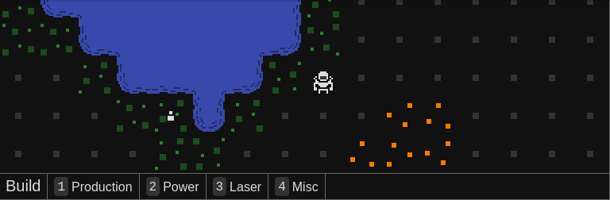
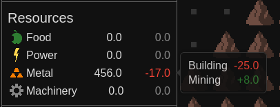
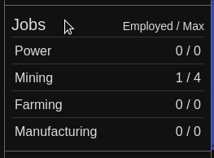
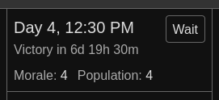

June was devoted to the four main remaining parts of the new UI:

- The build menu
  
- The resources UI
  
- The jobs UI with drag and drop for changing priority
  
- And the status UI
  

For July, I'll start alternating between playtesting and the many smaller UI enhancements in my to-do list, as well as a few bug fixes. 