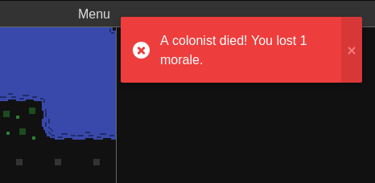
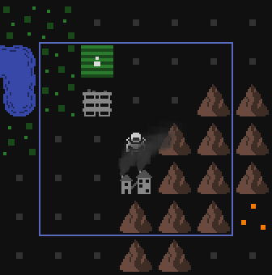
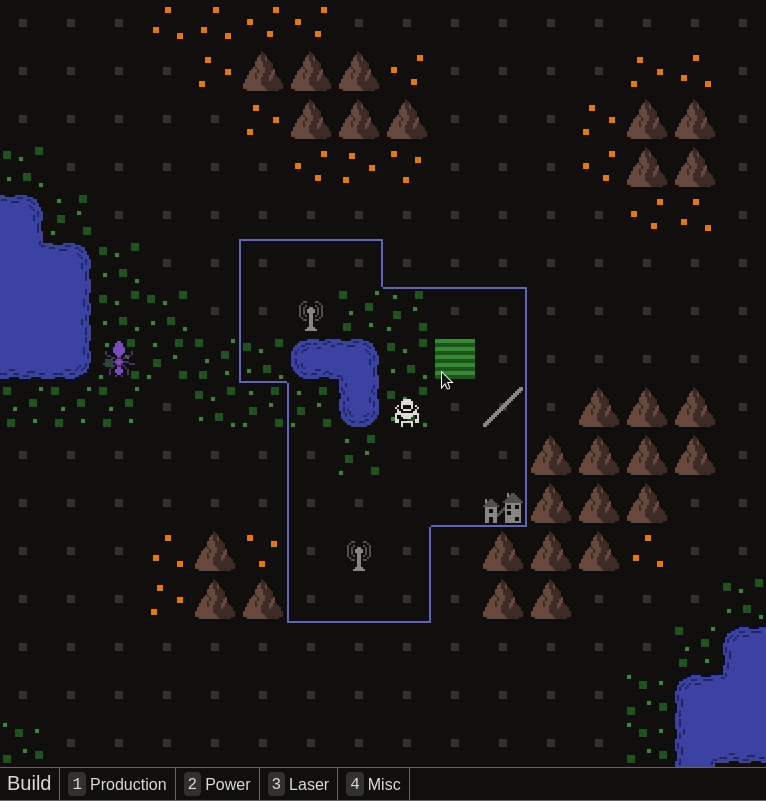
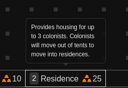

In July I made many tweaks for balance and UI polish. There will be many more to come for August.

- Changed the victory condition from reach population X to survive X days and added a game over dialog with an option to continue playing if you won -- the game is now fully playable from start to finish for the first time since the UI rewrite
  
- Display messages with toasts
  
- Change the smoke effect to be more subtle so it doesn't obscure the tile above too much
  
- Added a border that shows your reflector placement range
  
- Zoom in and out with the mouse wheel
  
- Added tooltips to the build menu
  
- Changed the starting setup -- you now start with 3 colonists, a mine, and a farm, instead of a single colonist and a mine
- And a few a bug fixes
