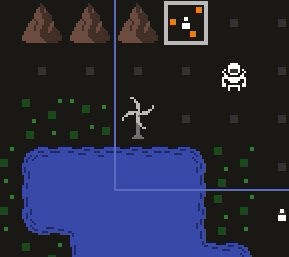
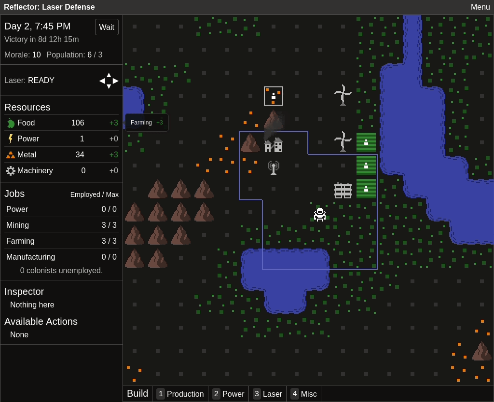
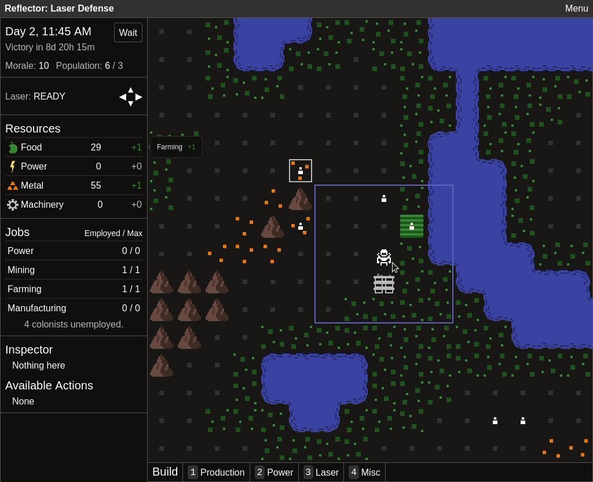
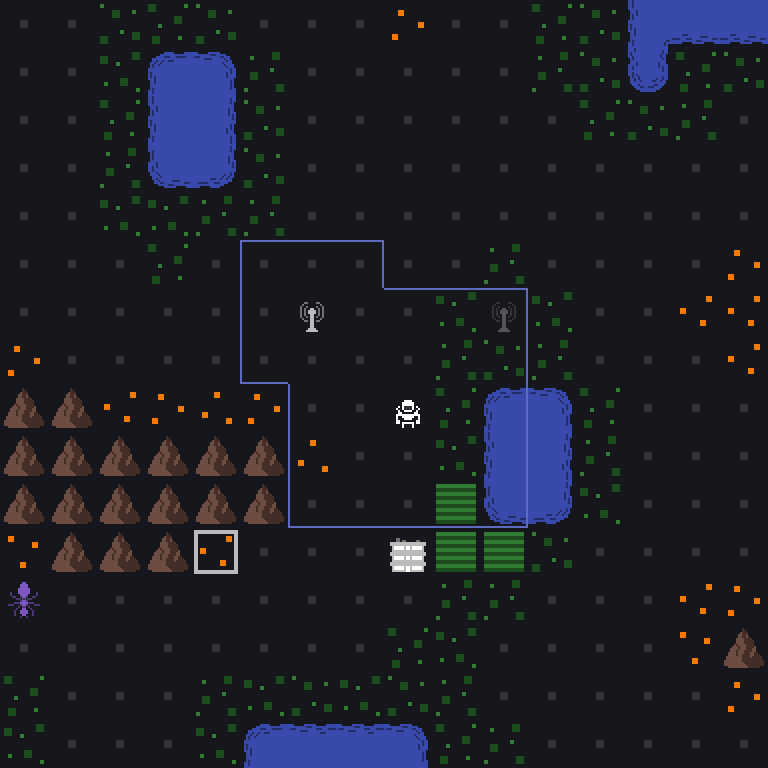

This was my most productive month in a while! Alpha 2 really feels like it's shaping up.

The most exciting changes this month:

- Windmills now spin when they're working.
  
- The map background color now changes with night and day. Day and night is very important in Reflector. Colonists work during the day. Enemies attack at night. For something so central to the game, it wasn't very visible until now.
  
- Single turn undo. Everything in Reflector dies in a single hit, so a single mistake can mean game over. Combat is fully deterministic (no dice rolls or the like), so an undo system can't be abused like it could in some other games. If you lose, the undo button will be displayed in the game over pop up, but it can also be used at other times via a keyboard shortcut or the (unimplemented) menu in the top right.
  
- Laser must recharge for a turn after firing. In Alpha 1, lasers had strength, and each time they hit something or were split, they lost one strength, until they reached zero and stopped. This mechanic seemed to cause some confusion, so a while back I changed it so lasers have infinite strength, but that's a little too strong now. Rather than reintroducing limited strength (it just feels better to fling lasers all the way across the map), I added a one turn cooldown between shooting. The UI for this can be seen in the gif above.
- Buildings that can be inactive or active now toggle between a bright gray or dark gray.
  

Less flashy, but I also got the following done:

- Fixed a longstanding bug that caused destroyed things to still be visible and things that do exist to be invisible
- Found a keyboard control scheme that doesn't annoy me (I can finally playtest for more than 10 minutes at a time, so this is actually the most impactful change)
- Defined all shortcuts and settings in JSON (not exposed to the user yet, but this is the first step towards customizable keyboard shortcuts)
- Thinner outline for highlighted cursor, valid building locations
- Display number of unemployed colonists beneath the jobs
- Display housing capacity along with population
- A variety of less notable bug fixes, balance adjustments, and UI tweaks

# Alpha 2, what's left?

- Tooltips everywhere
- Toast messages for a variety of situations
- More information in the inspector
- Menu, with some basic options (new game, view controls, toggle fullscreen)
- Some UI for initial game loading
- Screen to display keyboard shortcuts (won't be editable for Alpha 2)
- Testing for a variety of screen sizes

Once I get those first three done, I'll start reaching out to friends and family for some additional playtesting. If nothing major comes up, Alpha 2 should be ready for a late September or early October release. On the other hand, Crusader Kings 3 comes out tomorrow, so September might not be as productive as August.
