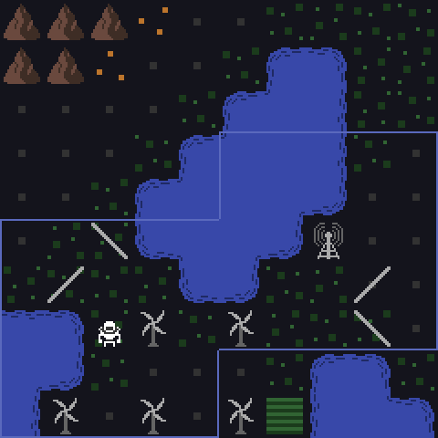

Short update this time around. As planned, I've slowed down the pace of development a bit after the release of Alpha 2. I'm working on incorporating feedback, refactoring some messy code, improving performance, and adding full keyboard support.

The only visual change to share this month is some changes to make enemies easier to see. Some players didn't notice enemies approaching until it was too late. To address this:

- Enemies are now a brighter color
- Farms, fertile land, and ore are now duller colors
- Enemies now have a slightly animated sprite
- Enemies flash when they first enter the screen

Here's the result:

November I'll continue working on some UX and balance changes for 2.1, which I currently plan to release late November or early December. That release most likely will not include an interactive tutorial, which will instead come in 2.2 or 3.0.