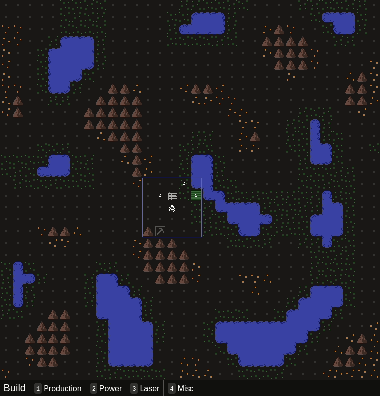
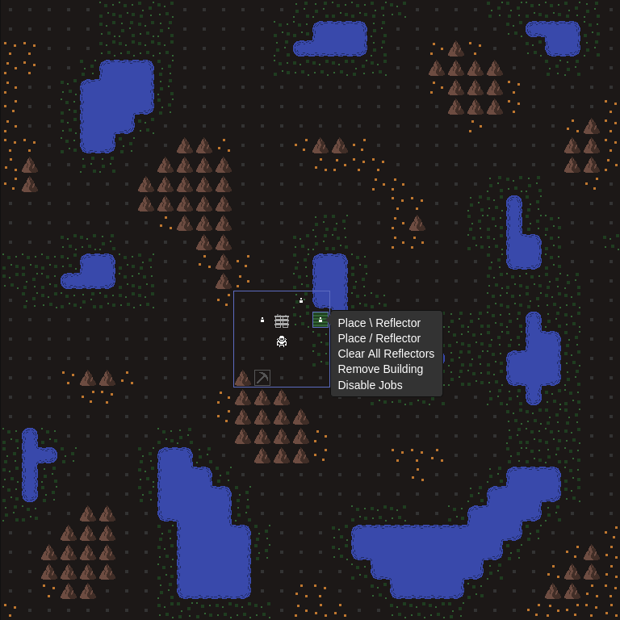

For alpha 2, the game was mostly playable with only keyboard, but there were a few menus and miscellaneous controls that were mouse only. Much of this month was spent addressing those last few mouse-only UIs. I ran into some limitations with the hotkey library I was using, and after trying a couple others, decided to write my own. That was a fair bit of work, but I'm happy with the result. Now everything except changing job priorities can be done via keyboard. I need a bit of break from working on hotkeys, but I'll address job priorities before the release of 2.1.

While working on the hotkeys, I also made some updates to the contextual action menu (right-clicking on the map) and the build menu. They now both make use the library I'm using for tooltips, which helps simplify some of my code and also gives a more consistent look and feel. Here's the results:

I was looking at a late November or early December release, but the keyboard work took a bit longer than expected (especially because it wasn't exciting work, so it drove my productivity down). Now I'm looking at getting something out for the New Year. I'll have a decent chunk of time off from my day job at the end of the year, so I should be able to get good amount done.
