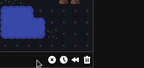

This month, I finished everything I want for the Alpha 2.1 release, except I've decided to add one more thing: an interactive tutorial. I'm not currently collecting any metrics, but from the feedback I have, it seems like many potential players are bouncing off because of the lack of a tutorial. This has been on my to-do list though originally just in the "before I call this game complete" category. It has gradually become higher and higher priority. First, getting schedules for Alpha 4, then Alpha 3, and now finally Alpha 2.1.

So, what will this tutorial actually look like? I'm still figuring out the details, but the plan is for it to take the in-game assistant form. So instead of a separate tutorial level, you will start an actual game and various triggers will tips about controls and mechanics, which can then be manually dismissed or automatically dismissed by player actions. This style of tutorial can be seen in Frostpunk, RimWorld, Stellaris, and I'm sure many other games. This will be more work up front, but should require less maintenance than static tutorial levels or recorded videos.

With that said, Alpha 2.1 is probably a few weeks out. As always, if you want to try the bleeding edge version, you can do so at https://reflector-unstable.netlify.app. Feedback is much appreciated!

Enough talk about the future -- what did I get done this past month? Lots!

- **Contextual quick actions.** Clicking on the map used to just cycle between reflectors, and anything else required right-clicking. Now it is contextual based on the contents of the tile and the game state: build, move, cancel move, place/rotate/remove reflector, disable/enable jobs.

- **Click to move.** This is something multiple playtesters tried to do. Initially, I didn't plan on implementing this, because clicking to place reflectors is very convenient, but the contextual quick action framework provided a solution: while aiming, click will cycle reflectors, otherwise clicking will move you to the location. Moving across the entire map can be deadly though, as I discovered while testing this feature, so if any enemies are present you will only move 1 space.

  

- **Building warnings.** There are some things you're allowed to do, but probably shouldn't. Now when building, warning can be shown if you might want to reconsider a certain position. This is currently only used for buildings that would block windmills, but definitely could be used for other things in the future.

  

- **Keyboard controls for job priorities.** This was the last piece of UI that was mouse-only. Now everything can be done with keyboard only (or mouse only) for those who prefer or require it.

  

- **Misc actions in the bottom menu.** Clear reflectors, undo, wait, and dismiss notifications are now all in the bottom right. Before they were scattered about in various places (except dismiss notifications, which didn't exist before)

  

- **Show laser on player tile.** Before the laser you're aiming didn't start until the tile next to the player, which could be confusing when standing next to a mountain which blocks all lasers.

  Before: 

  After: 

- **Big Economy Rebalance.** Most buildings are more expensive to build and require more energy to maintain. Machinery is much more expensive. Windmills and reactors provide more energy.

- **No more time.** Each turn represents 15 minutes of in-game time, and the status showed the current time of day. This abstraction seemed to cause some confusion, with sometimes players not realizing at first the game is turn-based. Now instead it just showed the current turn of the day/night. So "Day 1, Turn 1" instead of "Day 1, 6:00am".

- **Lots and lots of smaller tweaks and fixes.** This "small" release has taken longer than planned, but will be worth it! There's no big gameplay changes, but lots of polish to the UI that should be a big help for new and existing players alike!
