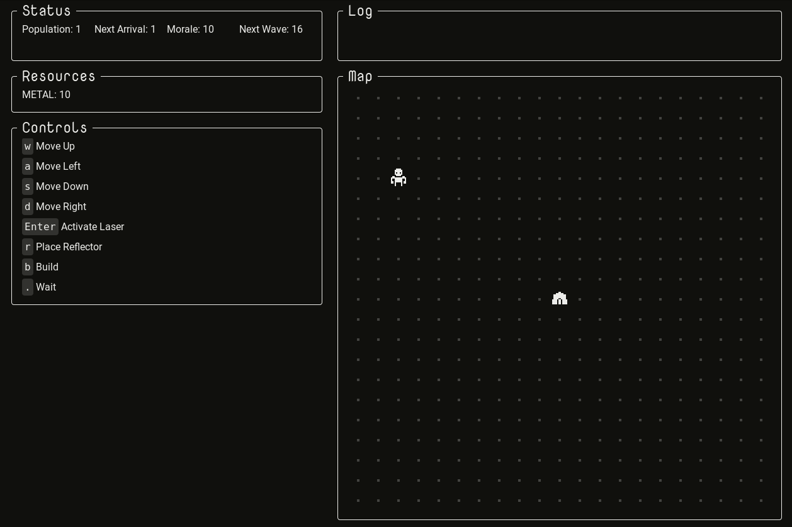

<a href="https://mscottmoore.itch.io/reflector" target="_blank">itch.io</a> | <a href="https://github.com/mscottmoore/reflector" target="_blank">GitHub</a>

Progress has been steady this week. For the first time since I purged most of the 7DRL content, things are starting to feel like a game again. Here's the changelog for the week:

- Implemented basic enemy that targets nearest destructible object
- Basic building mechanics
- Basic resource mechanics
- Mine building, which produces metal (the only resource for now, needed to build other things)
- Wall building, basic barrier against enemies
- Residence building, which can house up to three pops (otherwise they will place a tent somewhere random)
- Pops migrate to more desirable houses (currently just from starting tent to new residence building, but the system should work with new buildings too)
- Projectors, which allow you to place reflectors around them, instead of only around yourself
- Reflectors must be within range of you or a projector, otherwise they are destroyed
- Fixed a bug where valid building locations would stop being displayed after you tried to place a building in an invalid spot

Next week, I'm going to add some terrain and map generation, and then transition away from new mechanics and systems and into UX and balance. I'm hoping to have a reasonably balanced first iteration in a couple weeks time.

And since it's been requested, here's a gif:

