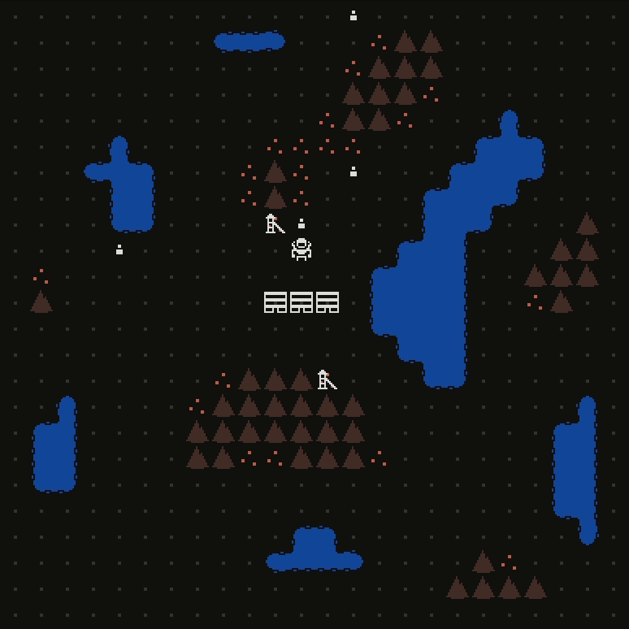

This week I got started adding colonists to the map (instead of just hiding in their houses and teleporting when they find a better house). For now, they just wander during the day, and return home at night, if they can find a home. Next week, I'll make them throw up tents if needed, and go work in the mines during the day.

