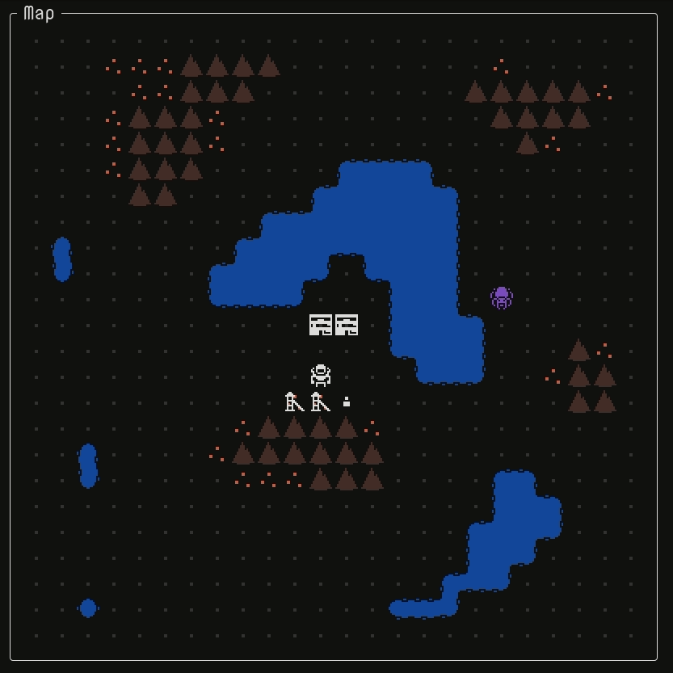

The holidays were full of cooking, family, and driving across the country. This last week, I got back to working on Reflector. Colonists will now pitch tents if there aren't enough residences. During the day, they go work in the mines, which no longer produce metal on their own. If there's no work, they'll wander around aimlessly.

Now that the framework is in place for jobs, I'll add some new buildings, jobs, and resource: food, oil, power, refined metal. That will probably take a couple weeks. After that, I plan on making each shot cost power and see how that goes. Then, it will be back UX improvements and balance for the next release.
