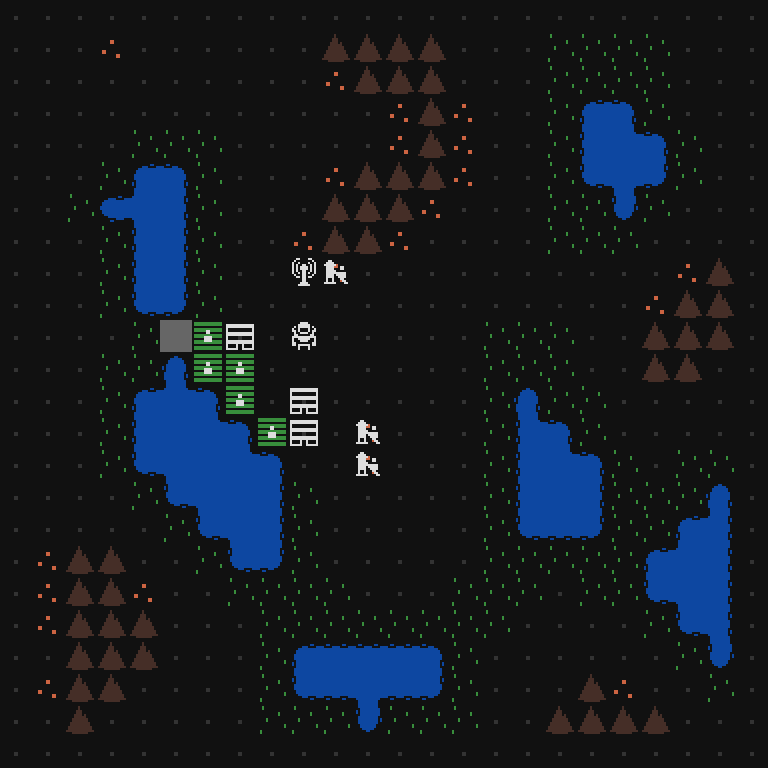

This week I added the first of the new resources: food! Here's how it works:

- Fertile land has been added as a new terrain. It is placed near water during map generation.
- A farm building has been added, which can be built only on fertile land.
- Each farm provides one job for a colonist, which produces 0.2 food when worked.
- On the last turn of each day, all colonists need to consume 1 food. If there's not enough, the colony loses 1 morale.

Those numbers will likely change once I start working on balance, but first I'm going to add more resources.
