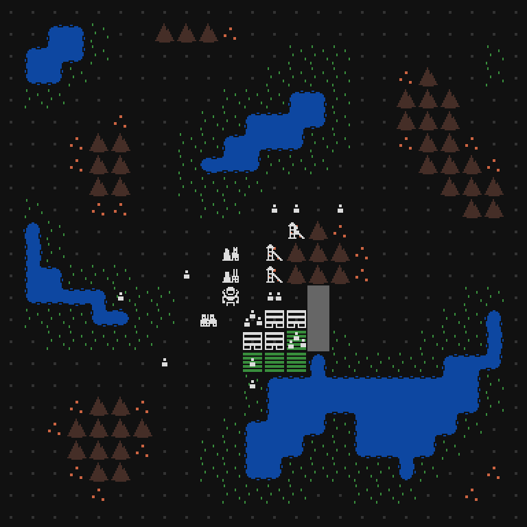

This week I added the last of new resources for alpha 2: power and refined metal.

- Power is created by colonists working in power plants
- Refined metal is created by colonists working at furnaces, but consumes metal and power to make
- Splitters and projectors are now built with refined metal instead of metal

I'm also trying out infinitely strong lasers. Before, each laser beam had limited strength, and each time they hit an enemy or were split, they lost one strength. This worked fine, but I really want to emphasize the laser manipulation mechanics. Now each beam can go through as many enemies as you manage to direct it towards. Each shot now costs power, to further incentivize killing multiple enemies with one shot. If you run out of power, you can still shoot, but it will only be a 1 strength beam. I might change this back while balancing alpha 2, but so far it is looking promising.

