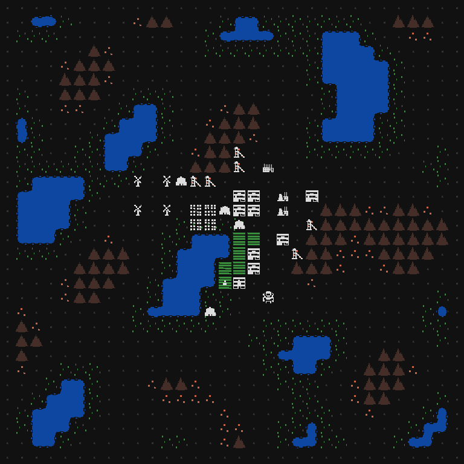

I'm continuing to work on new content and mechanics for Alpha 2 .Here's a summary of the changes:

- Added solar panels, which produce power during the day
- Added windmills, which produce power if there is nothing blocking any adjacent position
- Projectors now consume power, otherwise they stop working
- Increased map size
- Lasers now only hit 'tall' things; lasers can now shoot over farms and colonists

My remaining features part of my Alpha 2 to-do list is getting small, so I'll share it here:

- Split projector into basic and advanced (basic has shorter range)
- Split splitter into basic and advanced (basic needs power)
- Add ability to prioritize job types
- Add ability to forbid / turn off jobs for specific building
- Rework immigration mechanics (not fully decided here)
- Rework job and house assigning to be more efficient (for in-game logistics, not computationally)

That should take me 2-3 weeks. After that, I'll shift towards balance and UX. For Alpha 1, this phase took a much longer than I expected. One reason is that it frankly isn't as much fun as working on new content and mechanics. The second reason is that while playtesting, I kept on finding new UX annoyances to fix. I expect both reasons to come into play again for Alpha 2, but moreso. The complexity the base-management mechanics has increased a lot, so that will make good balance and good UX much harder.

Additionally, I've decided that this is the release to tackle changing the map size and adding full mouse controls, since I suspect both will become exponentially more difficult as the game continues to grow. Changing the map size also means changing the tile size to 24x24 pixels, so I'll need to redo all assets. This is going to be a big one, folks.
