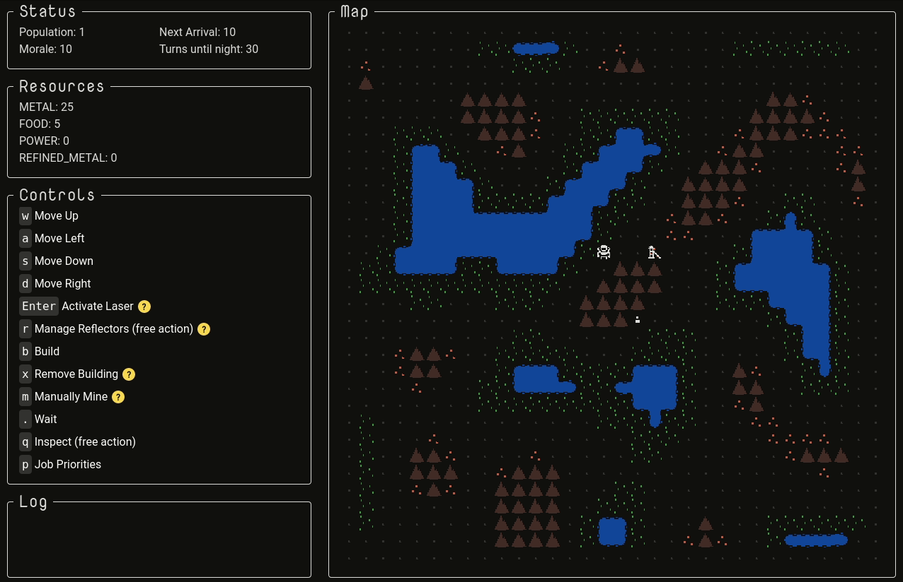

My main task this week was the interface for setting job priorities. Since I'm going to be overhauling the entire UI, I decided to start introducing some of the technologies I'm planning on using for that. For now, things are a messy mix of the new and the old. Here's the current job priority UI:

Changes this week:

- Changed lasers so they can shoot over low things such as colonists and farms
- Added ability to remove buildings (except occupied houses)
- Added a basic projector, with a shorter range than the normal projector
- Set up tailwindcss for future style overhaul
- Initial implementation of job priority UI (colonists currently ignore job priority)

Next up:

- Make colonists respect job priorities
- Add ability to disable jobs for individual buildings
- Add advanced splitter
- Add greenhouse
- Add mining spot (less efficient than mine but free to build)
- Remove mining action (manually mining vs building a mine has been a source of confusion)
