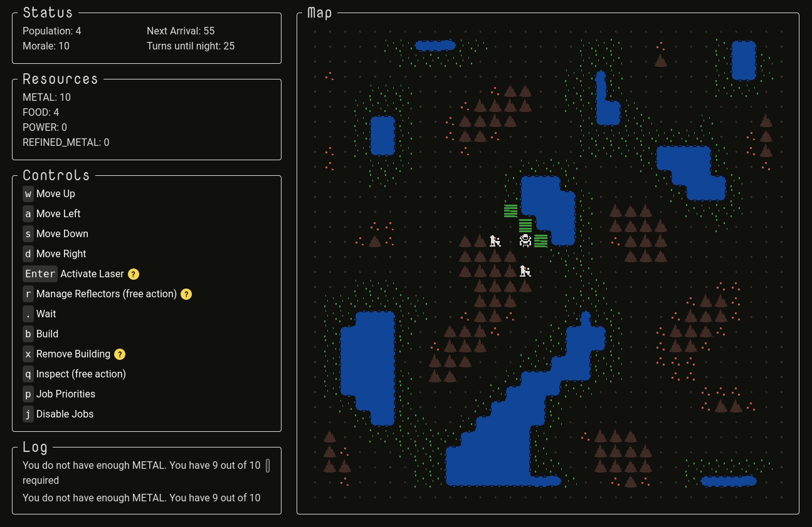

This week I finished up the new mechanics and content for alpha 2! The biggest change was implementing job priorities with the ability to disable jobs for specific buildings. In the gif below, you can see me prioritize farming over mining, cause colonists to go from the mines to the farms. I then disable two of the farms, and those colonists go back to the mines.

Changes this week:

- Colonists now fill jobs for prioritized job types first
- Each night, colonists of high-priority jobs get the first pick of residences, so colonists with high priority jobs will generally end up living closer to where they work
- Added the ability to disable jobs on a building-by-building basis
- Added the free-to-build mining spot; produces less metal than a mine
- Removed the mining action (this was intended to be used as source of metal if all mines got destroyed but the player didn't have enough metal to build a new one; it caused confusion and is no longer necessary with the mining spot)
- Added a greenhouse, which can be placed on any terrain and produces more food than a farm, but consumes power
- Added an advanced splitter, which splits any incoming beam into the other 3 directions
- Changed immigration so colonists arrive in a small groups at the start of each day, instead of one at a time throughout day and night

Next week I don't anticipate much coding. Instead, I'll be working on converting the sprites from 16x16 to 24x24 pixels, finishing a couple design books, and preparing for the UI redesign.

Here are my goals for the redesign:

- Switch to 24x24 pixel tiles
- Full intuitive mouse support
- Full intuitive keyboard support
- Generally more polished UI
- Make as much of the game state readable by looking at the map, no "inspect" necessary
