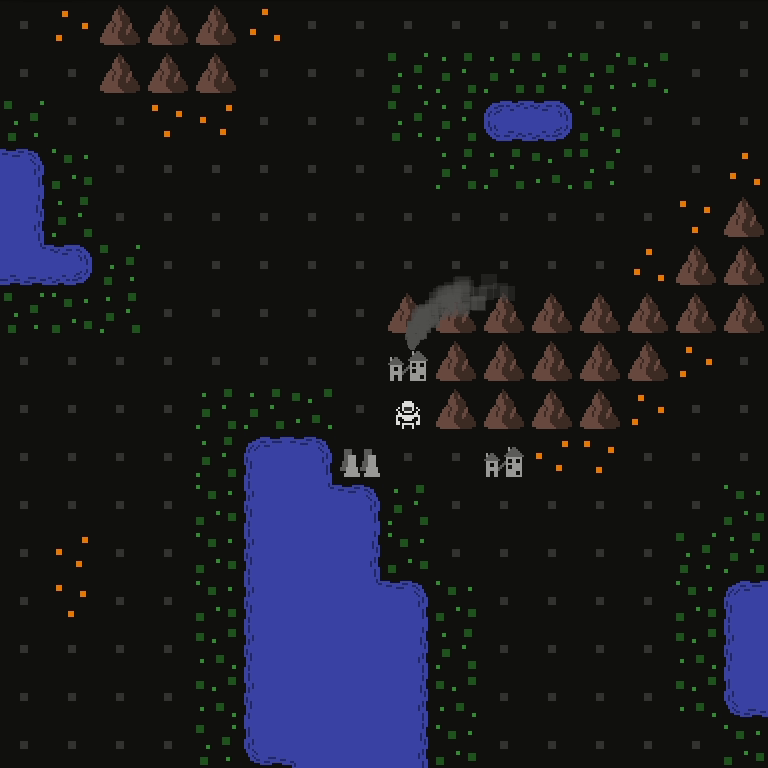

It's been a while since I posted anything. In the past couple months, Reflector has been on the back burner for me, but not completely forgotten. I'm not sure if I'll be going back to weekly updates like before, but if not I'll aim for monthly.

The latest addition is emitting smoke from buildings, so you can see at a glance what is active.

New since last update:

- All sprites switched from 16x16 to 24x24 pixels, many redesigned from scratch
- Ability to toggle between zoomed in and zoomed out
- Cleaned up display priorities of the various entities (which things are rendered on top)
- Smoke! Buildings can emit smoke from multiple locations based on various conditions, such as how many colonists are working

Currently smoke is only implemented for the mine, but with the code in place, it will be simple to add smoke to the other production buildings. That is my next priority. After that, I'll work on making residences visibly occupied, by lighting up the windows when colonists are inside. With those two features, I'm hoping that most important information will be visible without the need for any sort of "inspect" action.
