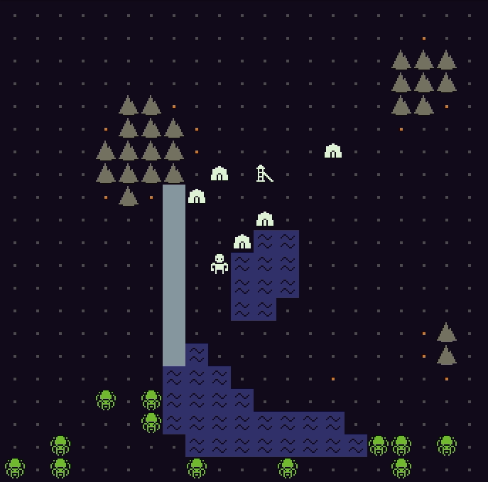
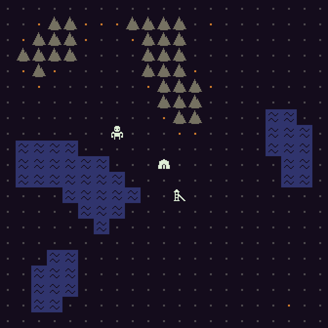
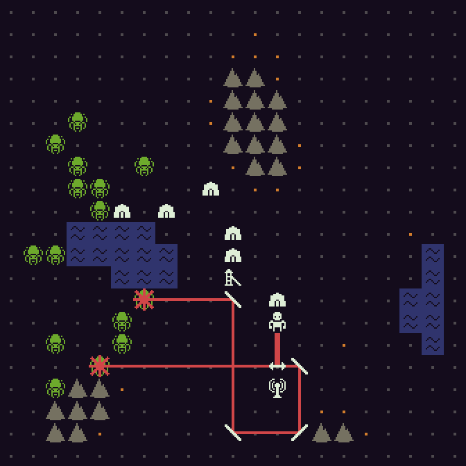

<a href="https://mscottmoore.itch.io/reflector" target="_blank">itch.io</a> | <a href="https://github.com/mscottmoore/reflector" target="_blank">GitHub</a>

This week I finished up all the mechanics and game systems I want for the initial version. I'll probably spend most of next week on some UX improvements before transitioning into balance changes.

Here's what's new:

- Walls are stronger now. They turn into damaged walls when hit instead of being destroyed right away.
  
- Random map generation with three types of terrain
  - Mountains block all movement and are indestructible
  - Water also blocks movement but your lasers can shoot over them
  - Ore doesn't affect movement but can be mined either manually or by mines (which must now be built on ore terrain instead of anywhere)
    
- Building now takes a turn (placing reflectors does not)
- Added new action to remove all reflectors
- Added new action to manually mine (if next to ore)
- Trying out a new color palette
- Rendering of reflecting and splitting lasers, instead of only the straight parts. It now looks much more satisfying when you have complex laser shenanigans.
  
