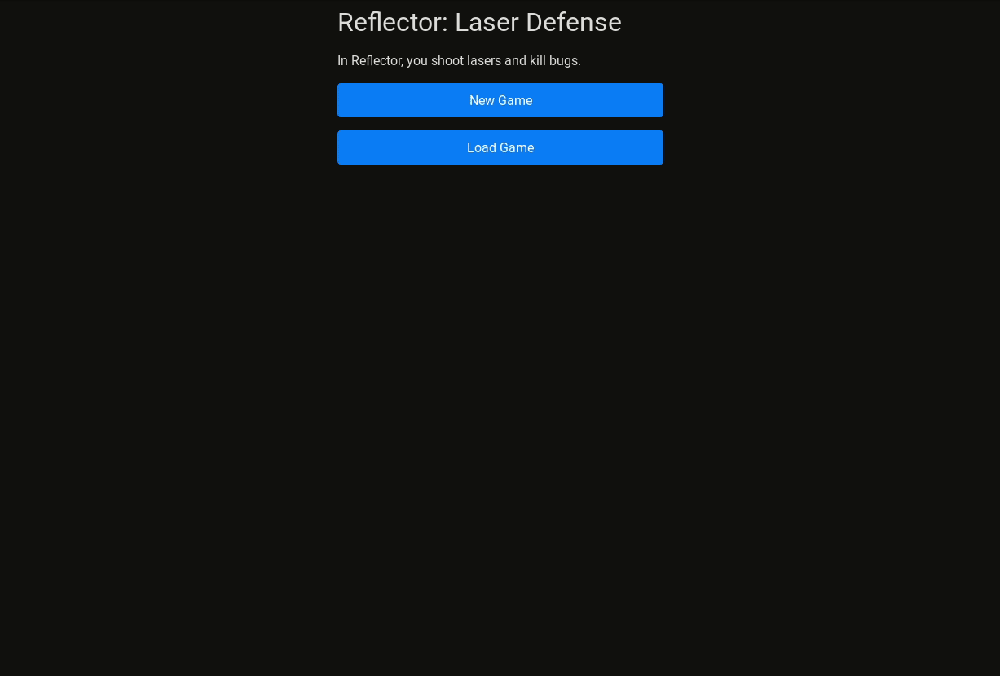

<a href="https://mscottmoore.itch.io/reflector" target="_blank">itch.io</a> | <a href="https://github.com/mscottmoore/reflector" target="_blank">GitHub</a>

This week was focused on UX changes. There's a couple more UX changes I want to make, and then I'll shift focus to playtesting and balancing for an initial release. I'll likely find some bugs and papercuts along the way, but I'm hoping to have this out in a couple weeks.

Here's what's new:

- Changed the ore graphic to distinguish it from normal ground by more than just color
- The player now turns into a corpse/skull when killed instead of disappearing
- Added very basic mouse controls (no interaction with the map yet)
- When placing reflectors or building, the target now jumps over invalid spots (this needs some tweaking though)
- When placing reflectors or building, it now shows valid spots with a dashed border and your currently targeted spot with a solid border
- Log a message if there are no valid spots in range
- Log a message if you cannot afford to build a building
- Added an inspect action
- Clearly distinguish actions which do not take a turn
- Added tooltips to some actions
- Game now autosaves every turn
- Added a main menu where you can select new game or load game
- Show a warning if the current version does not match the saved game version
- I'm still playing around with color palettes
- Various style tweaks, text changes, and bug fixes

I don't feel like taking a bunch of screenshots for all of the above (and that would probably be pretty boring), so instead here's a gif of the latest:

