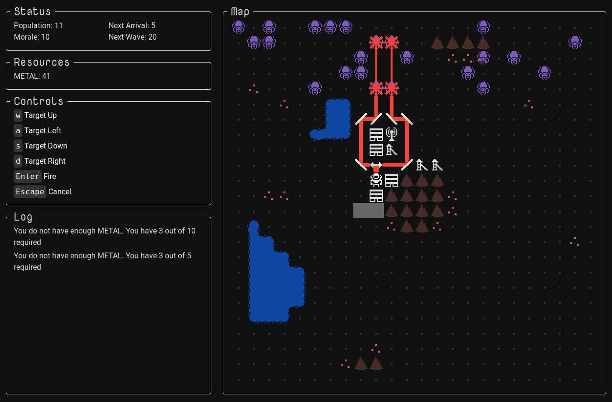

<a href="https://mscottmoore.itch.io/reflector" target="_blank">itch.io</a> | <a href="https://github.com/mscottmoore/reflector" target="_blank">GitHub</a>

This was a bit of a light week. I finished up all the UX changes I want for the initial release and got started with some balancing. It's all playtesting from here on out until release.

Here's what's new:

- New sprite for player
- New graphics for water
- Added description to game opening page
- Added a dialog on game end with a restart button
- Changed all references of pops to colonists
- Disabled all game controls on game over
- Increased laser power
- Increased map size
- Restyling of interface to better handle different screen sizes
