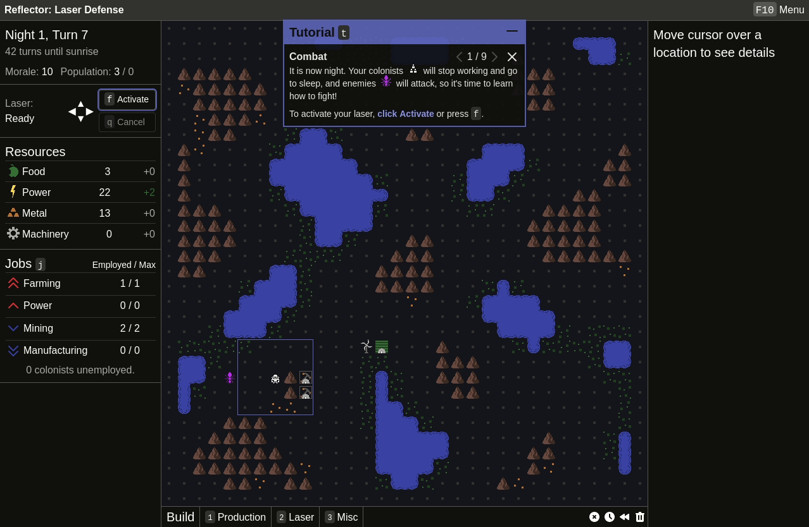

Four months in the making, Alpha 2.1 is finally here! Go play it at <a href="https://oatmealproblem.itch.io/reflector" target="_blank" rel="noopener noreferrer">itch.io</a>!

Here's what it all includes:

- An interactive tutorial to teach the basics
- Full keyboard support. Play with only keyboard, only mouse, or somewhere in between
- Big rebalance of buildings and costs
- Many, many usability improvements

Reflector: Laser Defense has never been more accessible, so if you had trouble before, give it another go!
