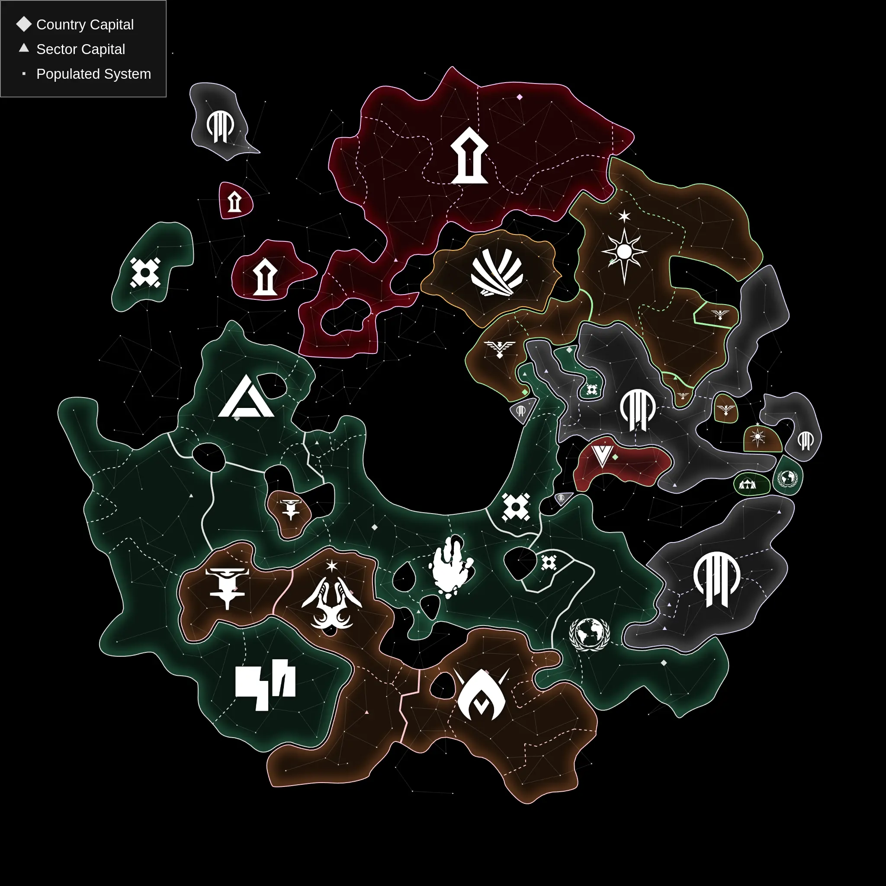

## StellarMaps

It's been a relatively slow month for StellarMaps. I continue to make progress on the Stellaris-independent data format. Most notably, _unions mode_ (federations and subjects) is now working. In the new data format, unions are represented as factions that have other factions as members, which can be deeply nested. Although data imported from Stellaris won't make use of that, in the future when map editing is supported, it could be used for complex feudal structures.



Even more behind-the-scenes, I've pulled in the library [Effect](https://effect.website) to help with data processing. This provides robust type checking and error handling. Currently, I'm mostly using it to define the `Snapshot` data structures with validators and helper methods. For example, here's the `Faction` class:

```ts
export class Faction extends Schema.Class<Faction>('Faction')({
	id: FactionId,
	name: Schema.String,
	flag: Flag,
	capitalId: Schema.NullOr(SystemObjectId),
}) {
	#ctxRef: WeakRef<Snapshot> | null = null;
	set ctx(ctx: Snapshot) {
		this.#ctxRef = new WeakRef(ctx);
	}
	get ctx(): Snapshot {
		const ctx = this.#ctxRef?.deref();
		if (ctx == null) throw new Error('Context not set');
		return ctx;
	}

	get capital(): SystemObject | null {
		if (this.capitalId != null) {
			return this.ctx.systemObjects[this.capitalId] ?? null;
		} else {
			return null;
		}
	}

	get sectors(): Sector[] {
		return this.ctx.getSectorsWithFaction(this);
	}

	get systems(): System[] {
		return this.ctx.getSystemsWithFaction(this);
	}

	get members(): Membership[] {
		return this.ctx.getMembershipsWithOrganization(this);
	}

	get organizations(): Membership[] {
		return this.ctx.getMembershipsWithMember(this);
	}
}
```

The methods simplify a lot of later data processing (previously, these were all plain objects with no methods). In the future I'll also use Effect for the data processing pipelines, and for automatic data migration between StellarMaps versions.

# Beyond Development

Where's all my time gone otherwise this month?

- Work is busy, with my employer in the process of getting acquired
- House work is also busy, with the final stage of an insurance claim and early stage of a kitchen remodel
- It's gardening season here in Minnesota
  - Harvesting strawberries and raspberries
  - Establishing a pollinator lawn, which mostly means lots of weeding
- Studying Chinese and Japanese in preparation for autumn travel
  - If anyone in Tokyo or Shanghai wants to meet up, reach out!
- Morrowind has been my chill-out game this month. That game holds up, and the [OpenMW](https://openmw.org) project is really impressive