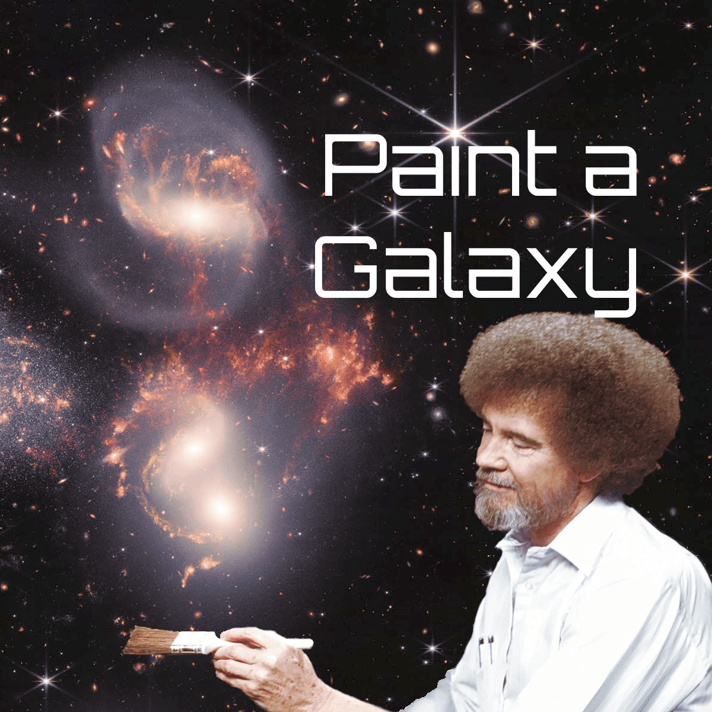

## StellarMaps

This past month, I continued working on converting features to the new Stellaris-independent data format. Wormholes, gateways, terra incognita, and relations mode are all working again. The largest remaining work there is solar system maps. Besides that, I need to convert a few more map modes, and implement some minor features like player names. All this data processing work is a bit boring to work on, but will be good in the long term. I also got fixes out for bugs that have been reported over the past few weeks.

To keep my interest, I decided to experiment with controls for creating a galaxy from scratch. This won't be in the next version, perhaps not even the version after that, but I wanted to work through some of the UX difficulties (and it sounded fun). Most simply, you could create a galaxy by hand placing each star and connection between stars. That would be quite tedious though for anything beyond a few stars, so some sort of random generation is needed. To strike a balance between automatic generation and user input, I experimented with "painting" the areas you want stars, then randomly placing stars based on how "bright" you painted each area. I also implemented an algorithm to place hyperlanes between the stars, with inputs for connectedness and maximum length, while guaranteeing that no hyperlanes cross and everything is connected.

Success! I had a lot of fun just drawing different shapes. It felt like a shame it would be so long before it was usable... but I wondered, how much work would it be to output a Stellaris static galaxy mod?

## Paint a Galaxy

I spun "Paint a Galaxy" out into it's own project, as a combo of [web app to create a custom galaxy](https://oatmealproblem.github.io/paint-a-galaxy) and [mod to play it in Stellaris](https://steamcommunity.com/workshop/filedetails/?id=3532904115)! This was at first easier than expected, but then became quite a bit of work as I discovered the various ways static galaxy mods don't quite behave like you'd expect. I fixed the worst of the issues, then released to a better than expected reception -- for a bit, the project was the top trending post in r/stellaris and the Stellaris Steam Workshop!

I expect Paint a Galaxy to remain my focus the next month or so, but I'm intentionally keeping the focus pretty tight. There are many niche use-cases I _could_ support, but I don't want to bloat the app, so I'll instead direct folks to manually mod their custom galaxies (and perhaps write some guides for some of the more common requests).

# Other Stuff

Where else have I been up to?

- As always work and house work
- I'm continuing my studies of Japanese and Chinese
  - I'm looking for a Chinese language practice partner -- reach out if you're interested!
- I started working through [Hands-On Rust](https://hands-on-rust.com/) to fill some knowledge gaps
- This month I've continued playing Morrowind and returned to Against the Stone -- both are amazing
